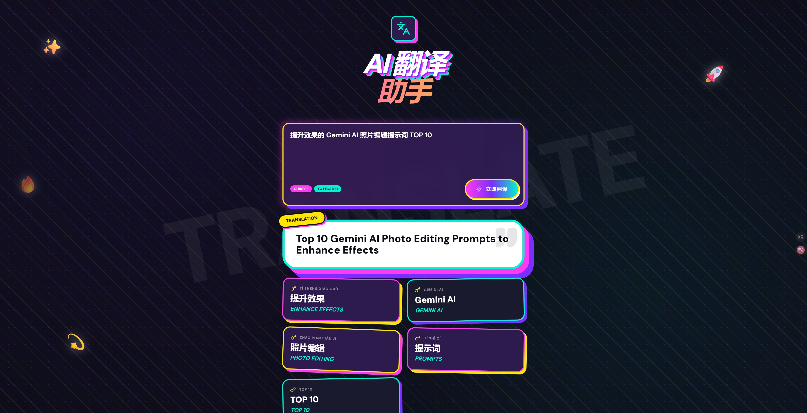
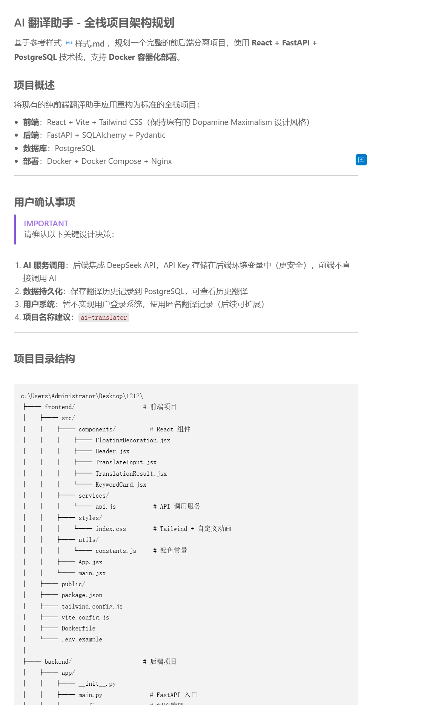
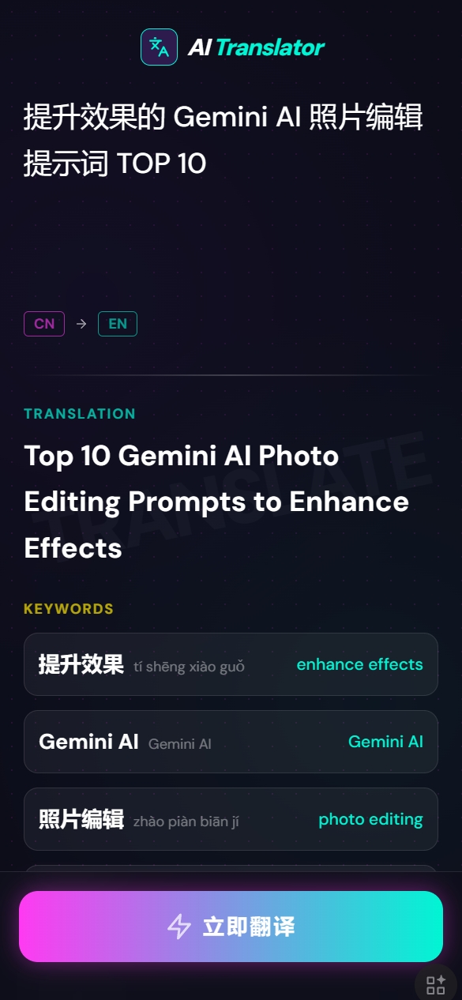
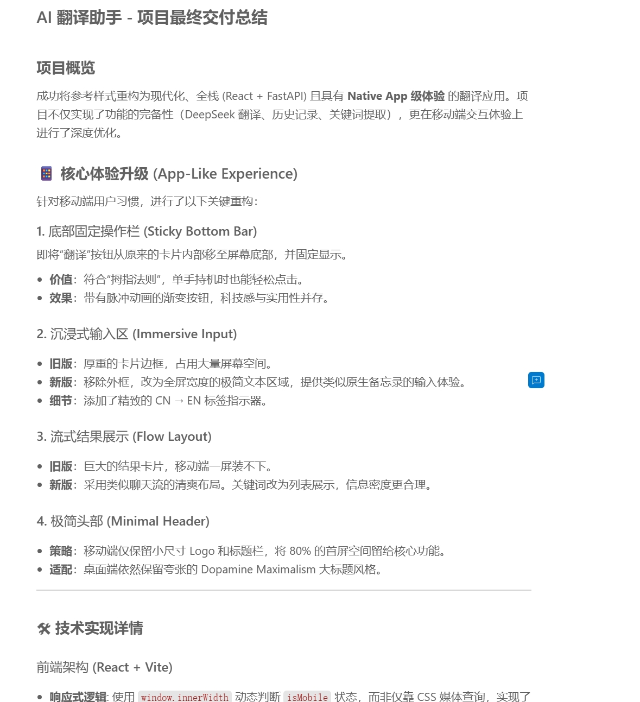
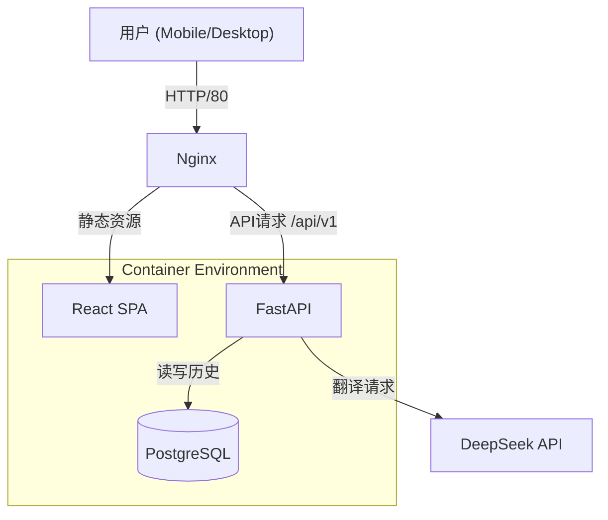

# AI 翻译助手 (AI Translator) ✨🚀

> **基于 DeepSeek AI 的次世代翻译应用 | Dopamine Maximalism 设计风格**



## 📖 项目简介

**AI 翻译助手** 不仅仅是一个翻译工具，它是一次对 **Web App 原生级体验** 的探索。

我们摒弃了传统的网页表单设计，采用了 **Dopamine Maximalism (多巴胺极简主义)** 视觉风格，结合 **Mobile-First** 的交互逻辑，为您带来极具沉浸感的翻译体验。

后端集成 **DeepSeek V3** 强大的语言模型，不仅提供精准的翻译，还能智能提取关键术语（包含拼音和解释），助您深度理解语言细微之处。

---

## 📱 核心亮点

### 1. 原生 App 级交互体验
我们重构了移动端界面，使其不再像一个“缩小的网页”。
*   **底部固定操作栏**：翻译按钮始终位于拇指热区，单手轻松操作。
*   **沉浸式输入**：去除了厚重的边框，提供干净、无干扰的输入环境。
*   **流式结果页**：结果以聊天流形式自然展开，信息密度完美适配手机屏幕。

<div align="center">
  
  
</div>

### 2. 强大的 AI 引擎
*   **DeepSeek Inside**：利用大模型的语境理解能力，拒绝生硬机翻。
*   **智能关键词提取**：自动识别文中的重点词汇，并提供“中文-拼音-英文”对照卡片。

### 3. 企业级全栈架构
*   **前后端分离**：标准 RESTful API 设计。
*   **安全可靠**：配置与代码分离，敏感密钥零泄露风险。
*   **数据持久化**：PostgreSQL 记录每一次灵感瞬间。



---

## 🛠 技术栈

| 领域 | 技术方案 | 关键特性 |
|------|----------|----------|
| **Frontend** | React 18 + Vite | 极速构建，组件化开发 |
| **Styling** | Tailwind CSS | 响应式设计，自定义动画 |
| **Backend** | FastAPI (Python) | 高性能异步框架，自动文档 |
| **Database** | PostgreSQL + SQLAlchemy | 健壮的关系型数据存储 |
| **AI** | DeepSeek API | 高性价比大模型服务 |
| **DevOps** | Docker Compose | 一键编排，环境一致性 |

---

## ⚡ 快速开始 (3分钟部署)

### 前置要求
*   Docker & Docker Compose
*   DeepSeek API Key

### 1. 克隆与配置
```bash
# 进入项目目录
cd ai-translator

# 复制环境变量模板
cp .env.example .env
```

### 2. 配置密钥
编辑 `.env` 文件，填入您的 DeepSeek API Key：
```ini
# .env
DEEPSEEK_API_KEY=sk-xxxxxxxxxxxxxxxxxxxxxxxx
POSTGRES_PASSWORD=my_secure_password
```

### 3. 一键启动
```bash
docker-compose up -d
```

稍等片刻，访问：
*   **Web 应用**: [http://localhost](http://localhost)
*   **API 文档**: [http://localhost:8000/docs](http://localhost:8000/docs)

---

## 🏗 系统架构



---

## 📝 许可证

MIT License © 2024 AI Translator